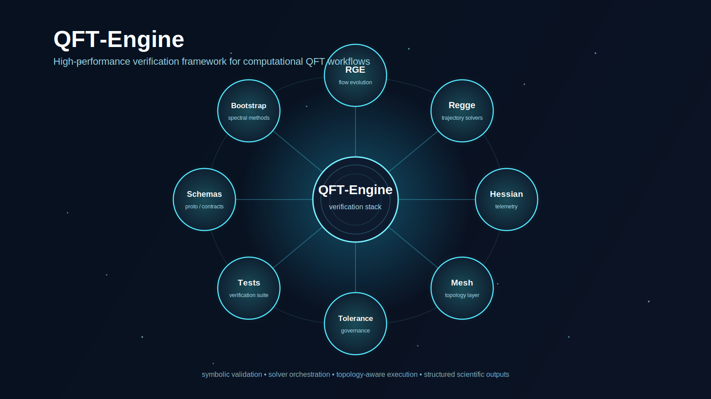

Save this as assets/qft-engine-hero.svg

<svg width="1600" height="900" viewBox="0 0 1600 900" fill="none" xmlns="http://www.w3.org/2000/svg">
  <defs>
    <linearGradient id="bgGrad" x1="200" y1="100" x2="1400" y2="800" gradientUnits="userSpaceOnUse">
      <stop stop-color="#07111F"/>
      <stop offset="1" stop-color="#0B1324"/>
    </linearGradient>

    <radialGradient id="coreGlow" cx="0" cy="0" r="1" gradientUnits="userSpaceOnUse" gradientTransform="translate(800 450) rotate(90) scale(260 260)">
      <stop stop-color="#29D3FF" stop-opacity="0.32"/>
      <stop offset="1" stop-color="#29D3FF" stop-opacity="0"/>
    </radialGradient>

    <radialGradient id="orbGlow" cx="0" cy="0" r="1" gradientUnits="userSpaceOnUse" gradientTransform="translate(0 0) rotate(90) scale(80 80)">
      <stop stop-color="#42E8E0" stop-opacity="0.30"/>
      <stop offset="1" stop-color="#42E8E0" stop-opacity="0"/>
    </radialGradient>

    <filter id="softGlow" x="-50%" y="-50%" width="200%" height="200%">
      <feGaussianBlur stdDeviation="18" result="blur"/>
      <feMerge>
        <feMergeNode in="blur"/>
        <feMergeNode in="SourceGraphic"/>
      </feMerge>
    </filter>

    <filter id="lineGlow" x="-50%" y="-50%" width="200%" height="200%">
      <feGaussianBlur stdDeviation="3" result="blur"/>
      <feMerge>
        <feMergeNode in="blur"/>
        <feMergeNode in="SourceGraphic"/>
      </feMerge>
    </filter>

    <pattern id="grid" width="48" height="48" patternUnits="userSpaceOnUse">
      <path d="M 48 0 L 0 0 0 48" stroke="rgba(255,255,255,0.05)" stroke-width="1"/>
    </pattern>
  </defs>

  <!-- Background -->
  <rect width="1600" height="900" fill="url(#bgGrad)"/>
  <rect width="1600" height="900" fill="url(#grid)" opacity="0.22"/>

  <!-- Background stars / particles -->
  <g opacity="0.55">
    <circle cx="180" cy="140" r="2" fill="#B8F7FF"/>
    <circle cx="320" cy="760" r="2" fill="#B8F7FF"/>
    <circle cx="520" cy="120" r="1.8" fill="#7DEBFF"/>
    <circle cx="690" cy="240" r="1.5" fill="#B8F7FF"/>
    <circle cx="920" cy="110" r="2" fill="#7DEBFF"/>
    <circle cx="1180" cy="190" r="1.6" fill="#B8F7FF"/>
    <circle cx="1340" cy="120" r="2" fill="#7DEBFF"/>
    <circle cx="1460" cy="680" r="2" fill="#B8F7FF"/>
    <circle cx="1280" cy="760" r="1.8" fill="#7DEBFF"/>
    <circle cx="240" cy="620" r="1.5" fill="#B8F7FF"/>
    <circle cx="1120" cy="640" r="1.5" fill="#B8F7FF"/>
    <circle cx="940" cy="780" r="1.5" fill="#7DEBFF"/>
    <circle cx="480" cy="820" r="1.5" fill="#7DEBFF"/>
    <circle cx="152" cy="480" r="1.5" fill="#B8F7FF"/>
  </g>

  <!-- Core glow -->
  <circle cx="800" cy="450" r="260" fill="url(#coreGlow)"/>

  <!-- Connection lines -->
  <g stroke="#4ADFFF" stroke-opacity="0.30" stroke-width="2" filter="url(#lineGlow)">
    <line x1="800" y1="450" x2="800" y2="170"/>
    <line x1="800" y1="450" x2="1040" y2="250"/>
    <line x1="800" y1="450" x2="1140" y2="450"/>
    <line x1="800" y1="450" x2="1040" y2="650"/>
    <line x1="800" y1="450" x2="800" y2="730"/>
    <line x1="800" y1="450" x2="560" y2="650"/>
    <line x1="800" y1="450" x2="460" y2="450"/>
    <line x1="800" y1="450" x2="560" y2="250"/>
  </g>

  <!-- Secondary connection ring -->
  <g stroke="#79F7FF" stroke-opacity="0.12" stroke-width="1.5">
    <path d="M800 170 C920 180 1000 210 1040 250"/>
    <path d="M1040 250 C1100 300 1130 370 1140 450"/>
    <path d="M1140 450 C1130 530 1100 600 1040 650"/>
    <path d="M1040 650 C980 710 900 735 800 730"/>
    <path d="M800 730 C700 735 620 710 560 650"/>
    <path d="M560 650 C500 600 470 530 460 450"/>
    <path d="M460 450 C470 370 500 300 560 250"/>
    <path d="M560 250 C620 190 700 170 800 170"/>
  </g>

  <!-- Central node -->
  <g filter="url(#softGlow)">
    <circle cx="800" cy="450" r="96" fill="#0E1B2F" stroke="#77F1FF" stroke-width="3"/>
    <circle cx="800" cy="450" r="78" fill="none" stroke="#77F1FF" stroke-opacity="0.25" stroke-width="1.5"/>
    <circle cx="800" cy="450" r="58" fill="none" stroke="#77F1FF" stroke-opacity="0.18" stroke-width="1"/>
  </g>

  <text x="800" y="438" fill="white" font-size="30" font-family="Arial, Helvetica, sans-serif" text-anchor="middle" font-weight="700">QFT-Engine</text>
  <text x="800" y="472" fill="#A8DFF2" font-size="16" font-family="Arial, Helvetica, sans-serif" text-anchor="middle">verification stack</text>

  <!-- Orbit nodes -->
  <!-- Top -->
  <g transform="translate(800 170)">
    <circle r="70" fill="#0D1A2C" stroke="#53E7FF" stroke-width="2.5"/>
    <circle r="92" fill="url(#orbGlow)" opacity="0.8"/>
    <text y="-6" fill="white" font-size="21" font-family="Arial, Helvetica, sans-serif" text-anchor="middle" font-weight="700">RGE</text>
    <text y="20" fill="#A8DFF2" font-size="12.5" font-family="Arial, Helvetica, sans-serif" text-anchor="middle">flow evolution</text>
  </g>

  <!-- Top right -->
  <g transform="translate(1040 250)">
    <circle r="70" fill="#0D1A2C" stroke="#53E7FF" stroke-width="2.5"/>
    <circle r="92" fill="url(#orbGlow)" opacity="0.8"/>
    <text y="-6" fill="white" font-size="20" font-family="Arial, Helvetica, sans-serif" text-anchor="middle" font-weight="700">Regge</text>
    <text y="20" fill="#A8DFF2" font-size="12.5" font-family="Arial, Helvetica, sans-serif" text-anchor="middle">trajectory solvers</text>
  </g>

  <!-- Right -->
  <g transform="translate(1140 450)">
    <circle r="70" fill="#0D1A2C" stroke="#53E7FF" stroke-width="2.5"/>
    <circle r="92" fill="url(#orbGlow)" opacity="0.8"/>
    <text y="-6" fill="white" font-size="19" font-family="Arial, Helvetica, sans-serif" text-anchor="middle" font-weight="700">Hessian</text>
    <text y="20" fill="#A8DFF2" font-size="12.5" font-family="Arial, Helvetica, sans-serif" text-anchor="middle">telemetry</text>
  </g>

  <!-- Bottom right -->
  <g transform="translate(1040 650)">
    <circle r="70" fill="#0D1A2C" stroke="#53E7FF" stroke-width="2.5"/>
    <circle r="92" fill="url(#orbGlow)" opacity="0.8"/>
    <text y="-6" fill="white" font-size="19" font-family="Arial, Helvetica, sans-serif" text-anchor="middle" font-weight="700">Mesh</text>
    <text y="20" fill="#A8DFF2" font-size="12.5" font-family="Arial, Helvetica, sans-serif" text-anchor="middle">topology layer</text>
  </g>

  <!-- Bottom -->
  <g transform="translate(800 730)">
    <circle r="70" fill="#0D1A2C" stroke="#53E7FF" stroke-width="2.5"/>
    <circle r="92" fill="url(#orbGlow)" opacity="0.8"/>
    <text y="-6" fill="white" font-size="17" font-family="Arial, Helvetica, sans-serif" text-anchor="middle" font-weight="700">Tolerance</text>
    <text y="20" fill="#A8DFF2" font-size="12.5" font-family="Arial, Helvetica, sans-serif" text-anchor="middle">governance</text>
  </g>

  <!-- Bottom left -->
  <g transform="translate(560 650)">
    <circle r="70" fill="#0D1A2C" stroke="#53E7FF" stroke-width="2.5"/>
    <circle r="92" fill="url(#orbGlow)" opacity="0.8"/>
    <text y="-6" fill="white" font-size="19" font-family="Arial, Helvetica, sans-serif" text-anchor="middle" font-weight="700">Tests</text>
    <text y="20" fill="#A8DFF2" font-size="12.5" font-family="Arial, Helvetica, sans-serif" text-anchor="middle">verification suite</text>
  </g>

  <!-- Left -->
  <g transform="translate(460 450)">
    <circle r="70" fill="#0D1A2C" stroke="#53E7FF" stroke-width="2.5"/>
    <circle r="92" fill="url(#orbGlow)" opacity="0.8"/>
    <text y="-6" fill="white" font-size="18" font-family="Arial, Helvetica, sans-serif" text-anchor="middle" font-weight="700">Schemas</text>
    <text y="20" fill="#A8DFF2" font-size="12.5" font-family="Arial, Helvetica, sans-serif" text-anchor="middle">proto / contracts</text>
  </g>

  <!-- Top left -->
  <g transform="translate(560 250)">
    <circle r="70" fill="#0D1A2C" stroke="#53E7FF" stroke-width="2.5"/>
    <circle r="92" fill="url(#orbGlow)" opacity="0.8"/>
    <text y="-6" fill="white" font-size="17" font-family="Arial, Helvetica, sans-serif" text-anchor="middle" font-weight="700">Bootstrap</text>
    <text y="20" fill="#A8DFF2" font-size="12.5" font-family="Arial, Helvetica, sans-serif" text-anchor="middle">spectral methods</text>
  </g>

  <!-- Title zone -->
  <text x="120" y="106" fill="white" font-size="52" font-family="Arial, Helvetica, sans-serif" font-weight="700">QFT-Engine</text>
  <text x="120" y="146" fill="#99D7E8" font-size="22" font-family="Arial, Helvetica, sans-serif">
    High-performance verification framework for computational QFT workflows
  </text>

  <!-- Bottom caption -->
  <text x="800" y="850" fill="#7FB4C8" font-size="16" font-family="Arial, Helvetica, sans-serif" text-anchor="middle">
    symbolic validation • solver orchestration • topology-aware execution • structured scientific outputs
  </text>
</svg>

README line to use

  

Best repo structure

assets/
└── qft-engine-hero.svg

Easy custom edits

Change the orbit labels here:
	•	RGE
	•	Regge
	•	Hessian
	•	Mesh
	•	Tolerance
	•	Tests
	•	Schemas
	•	Bootstrap

If you want them more physics-heavy, swap them to:
	•	BRST
	•	RGE
	•	Spectral
	•	Bootstrap
	•	Regge
	•	Hessian
	•	Mesh
	•	Tolerance

If you want them more engineering-heavy, swap them to:
	•	Solvers
	•	Schemas
	•	Mesh
	•	Telemetry
	•	Tests
	•	Deploy
	•	Precision
	•	Validation

Pro-level tweak

GitHub renders SVG well, but very small text can get fuzzy on mobile. If that happens:
	•	bump node label sizes by +1 or +2
	•	shorten subtitles
	•	or remove the small subtitle text inside each orbit

Stronger version for your README top

Use this exact section above your overview:

  

  <em>QFT-Engine connects symbolic validation, solver execution, topology-aware orchestration, and reproducible outputs in one research-grade verification stack.</em>

Next move: I can give you a Version 2 SVG that looks even more cinematic, with curved orbital paths, depth rings, glowing particle links, and a more futuristic flagship open-source look.